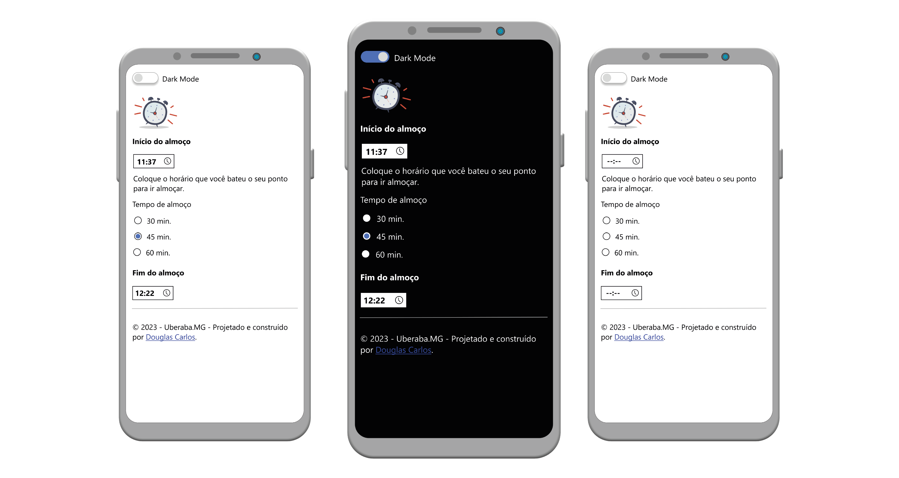

# Fim do almoço

### Esse projeto faz parte dos meus estudos sobre desenvolvimento Web Front-End

Aplicativo Web para calcular o horário de almoço. No seu desenvolvimento foi utilizado HTML, CSS, JavaScript, jQuery, Bootstrap, Dark Mode e Figma.

## Recursos usados no desenvolvimento:

- HTML;
- CSS;
- JavaScript;
- [Bootstrap](https://github.com/twbs/bootstrap) v5.3.0;
- [jQuery](https://github.com/jquery/jquery) v.3.5.1;
- [Moment.js](https://momentjs.com/) v2.29.4;
- [Dark Mode Switch](https://coliff.github.io/dark-mode-switch/) v1.0.1;
- [Apache HTTP Server](https://github.com/apache/httpd);
- [Git](https://git-scm.com);
- [Visual Studio Code](https://github.com/Microsoft/vscode/);
- Figma;

## Obtendo uma cópia:

```shell
# Antes de tudo, clone o projeto
$ git clone https://github.com/douglascarlos-dev/fim-do-almoco
```

## Figma:

- [Visualize animação no Figma](https://www.figma.com/proto/ZtXo9e7U70WCEFY6OoR2qK/Fim-do-Almo%C3%A7o?page-id=0%3A1&node-id=2-2&viewport=35%2C349%2C0.75&scaling=scale-down&starting-point-node-id=2%3A2)

